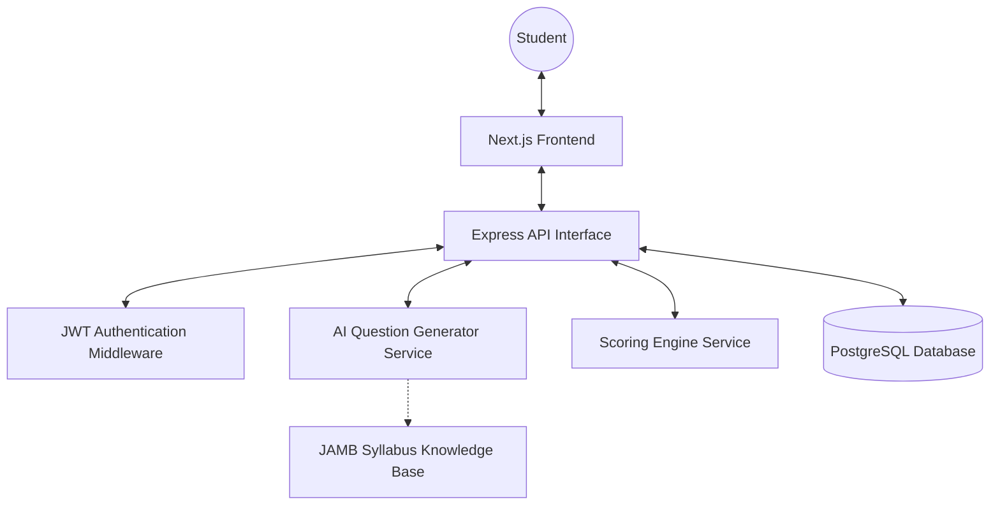

# System Architecture

The Strong Tower Mock JAMB CBT Platform follows a modern three-tier web application architecture:

## 1. Presentation Tier (Frontend)
- **Framework**: Next.js (React)
- **Styling**: Vanilla CSS with custom design system tokens (CSS Variables)
- **State Management**: React Context / Hooks
- **Key Features**:
  - Exam Dashboard
  - Subject Selection
  - Professional CBT Exam Interface
  - Real-time Timer Sync
  - Instant Performance Analytics

## 2. Application Tier (Backend)
- **Framework**: Node.js with Express.js
- **Authentication**: JWT (JSON Web Tokens)
- **AI Question Engine**: A specialized module that generates questions based on the JAMB syllabus and novel-specific data.
- **Scoring Engine**: Logic to calculate subject-specific and total scores instantly.
- **Timer Management**: Server-side validation and control of the exam duration.

## 3. Data Tier (Database)
- **Database**: PostgreSQL
- **Key Entities**:
  - Users
  - Exam Sessions
  - Answers
  - Results
  - Subject Syllabus Metadata

## Data Flow Diagram

## Anti-Cheating Strategy
1. **Server-Controlled Timer**: The timer value is calculated based on the difference between the current server time and the exam start time stored in the database.
2. **Session Persistence**: Exam sessions are tied to a unique `exam_id` in the database. If a user tries to start another session while one is active, they are redirected to their current session.
3. **Randomization**: The order of questions and options is randomized for each student's exam session.
4. **Auto-Submission**: A background job or a client-side trigger will submit the exam as soon as the calculated remaining time is zero.
